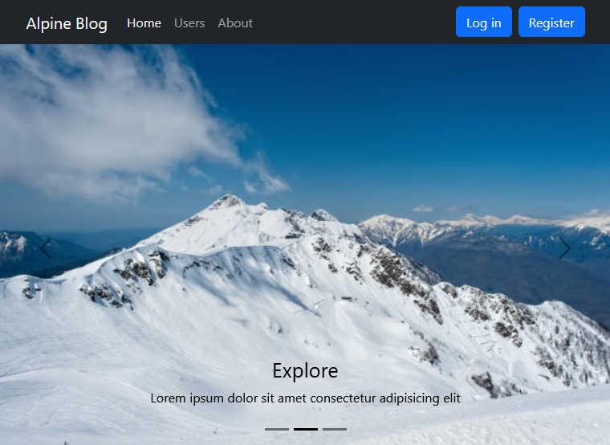

# Sample React-Bootstrap application

Test application for studying the capabilities of the component library [React Bootstrap](https://react-bootstrap.netlify.app/).

The library allows you to quickly create pages with standard elements.

| Component  | Created in (minutes) |
| ------------- | ------------- |
| NavBar  | 30  |
| Log In  | 30  |
| Slider  | 30  |
| Cards   | 10 |
| Jumbotron  | 30  |
| Image and text  | 10  |
| Footer  | 10  |
| Users   | 10  |
| About   | 10  |

How fast can you create a website like this?
